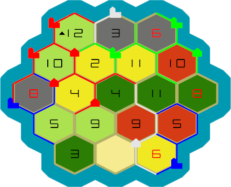

# FastCatan

This repository contains an implementation of 'The Settlers of Catan', 
suitable for development of Neural Nets (NN) and other algorithmic player to play the game.
It consists of a Catan Engine that can play catan games, 
an extensive GUI that can be used to set up, monitor, and play games of Catan, 
and can simultaneously be used to set up and monitor training sessions.

## Structure

There are four branches in this repository. The `master` branch can play both NNs, but requires CUDA to compile. 
The `ZwikAI` branch contains the NN made by Reinier Zwikker, and does not require CUDA. 
The `BeanAI` branch contains the NN made by Mauro Beenders, and does require CUDA to compile.
Finally, the `NoAI` branch does not contain any NNs yet, and can be used to test the base implementation of FastCatan, or for the development for other players.

### Code Structure

The code consists of a game and an app. The game, which is located in the `src` folder, manages the state of Catan and its players. The app handles the GUI and the interaction with the game.

#### Game

The game makes use of the board and the player classes. The board class keeps track of all the tiles, villages, cities and streets. The players keep track of their current resources and their available moves.
However, the player itself does not decide on what move to play. The brain of the player is the player agent, whose spot can be filled up by a human player or an AI player and who chooses which moves to play.
The game class itself manages which player currently has to play and connects the players to the board, it also keeps track of the dice throws.
A game manager is also present to allow for batches of games to be played, for use in the training of the NNs.

#### App

The app consists of a main screen on which the board is drawn using OpenGL. The user can than open new windows using the menu on the top of the screen. From here there are 3 types of windows available.
1) ImGui demo window, which shows inspiration for the windows and can be used for debugging.
2) The AI training windows, which consist of the AI menu that is used for the actual training of the AI and the replay menu, which allows to replay logged AI matches to see how they have played.
3) The debug windows, which show as many game details as possible and also allow for the switching of players and running single games.

### Game Structure

A game consists of 2-4 players, that each play a turn to complete a round, and play rounds until one player wins or the round limit is reached.

## Players

Various players have been written for FastCatan:

1. A Console Player, to play from the command line
2. A Gui Player, to play the basic moves from a GUI
3. A Random Player, this player selects a random available move to play
4. A ZwikAI Player, the NSSR Neural Net created by Reinier Zwikker
5. A BeanAI Player, the Neural Net created by Mauro Beenders
